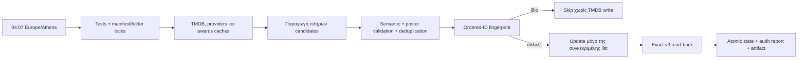

<p align="center">
  
</p>

<p align="center">
  <a href="https://github.com/nosvasedis/Nuvio-Collections/actions/workflows/sync.yml"></a>
  
  
  
  
  
  
  
  
</p>

<p align="center">
  <strong>Ελληνικές, δυναμικές και σημασιολογικά ελεγμένες συλλογές για το Nuvio.</strong><br>
  TMDB-backed rails που ανανεώνονται αυτόματα, χωρίς filler, mixed media lists ή κενά folders.
</p>

## Τι είναι

Το **Nuvio Collections v5.0.1** είναι το production σύστημα που μετατρέπει 548
folders και 2.677 ενεργά rails σε ένα έτοιμο προς εισαγωγή JSON για το Nuvio
0.8.3+. Δεν είναι ένα στατικό export: το repository περιέχει το canonical rail
registry, τους ακριβείς predicates, τα σταθερά public TMDB list IDs, τον
resumable synchronizer και το GitHub Actions workflow που κρατά τις λίστες
ενημερωμένες κάθε βράδυ.

Το τελικό artifact είναι το
[`dist/nuvio-collections-v5.0.1.json`](dist/nuvio-collections-v5.0.1.json).

## Κατάσταση release

| Έλεγχος | Αποτέλεσμα |
|---|---:|
| Collections | 13 |
| Folders | 548 |
| Ενεργά sources | 2.677 |
| Managed sources | 2.675 |
| Materialized TMDB lists | 2.675 |
| Native Nuvio/TMDB sources | 0 |
| Χειροκίνητα ορισμένα `recommended` sources | 2 |
| Κενά ενεργά rails | **0** |
| Κενά folders | **0** |
| Unresolved list IDs | **0** |
| Trakt / runtime-addon sources | **0 / 0** |
| Automated tests | **53 / 53** |
| Exact remote audit | **2.675 / 2.675 valid** |

Τα sources που επέστρεφαν αποδεδειγμένα μηδενικό αποτέλεσμα με τον ακριβή
predicate τους έχουν αποσυρθεί. Οι μόνες αλλαγές folder identity είναι οι δύο
ρητά εγκεκριμένες migrations που καταγράφονται παρακάτω.
Επιπλέον, αποσύρθηκαν μετά από ρητή έγκριση τα 6 TV rails των Jason Statham και
Tom Cruise: τα επίσημα TMDB credits τους δεν περιέχουν κανέναν ουσιαστικό
τηλεοπτικό ρόλο, μόνο self/guest/archive/uncredited εμφανίσεις. Τα παλιά list IDs
φυλάσσονται στο `state.retiredRails` ως audit/rollback
tombstones, αλλά δεν εμφανίζονται στο Nuvio και δεν ενημερώνονται nightly.

Στη v5.0.1 αφαιρέθηκε με ρητή έγκριση μόνο το folder `Ριάλιτι` και οι τέσσερις
λίστες του. Προστέθηκαν `Κορεατικά δράματα (K-Drama)`, `Ρομαντική κομεντί`, η
νέα collection `✨ Διάθεση & Ατμόσφαιρα` με 10 folders/60 rails και 18 νέες
χώρες. Από τα αρχικά 517 folders παραμένουν 516· μαζί με τις παλιότερες 2 και
τις 30 νέες προσθήκες το release έχει 548 fingerprint-locked folders.

Στις 12 Αυγούστου 2026 έγινε η εγκεκριμένη streaming migration: `Hulu`,
`Discovery+` και `Starz` αντικαταστάθηκαν από `MUBI`, `Criterion` και `AMC+`.
Και τα 94 παλιά list IDs διατηρούνται ως tombstones και έχουν διαγραφεί από το
TMDB μετά από ownership + 404 verification. Προστέθηκαν 92 ενεργά rails, επειδή
δύο Starz predicates ήταν ήδη αποδεδειγμένα κενά/retired. Έτσι διατηρούνται
ακριβώς 13 streaming folders, 455 streaming rails και όλα τα global counts.

Ο folder `Προτεινόμενα` είναι σκόπιμα χειροκίνητος και εξαιρείται από τον TMDB
materializer. Η canonical έκδοση v5.0.1 ανακατευθύνει τις ταινίες στο
`movielens.explore.toppicks.msly9zlu` και τις σειρές στο
`simkl.recipe.marathon.shows` μέσω του addon `aio-metadata`. Το folder
fingerprint κλειδώνεται ώστε bootstrap/compile/nightly sync να μην αλλάζουν
σιωπηρά αυτά τα links.

## Τελική χαρτογράφηση

| Collection | Native | Materialized | Σύνολο |
|---|---:|---:|---:|
| Discover, χωρίς `recommended` | 0 | 12 | 12 |
| Streaming | 0 | 455 | 455 |
| Genres | 0 | 192 | 192 |
| Film Series | 0 | 186 | 186 |
| Mood & Vibes | 0 | 60 | 60 |
| Studios | 0 | 107 | 107 |
| Networks | 0 | 59 | 59 |
| Actors | 0 | 744 | 744 |
| Directors | 0 | 186 | 186 |
| Awards | 0 | 60 | 60 |
| World | 0 | 424 | 424 |
| Decades | 0 | 186 | 186 |
| Runtime | 0 | 4 | 4 |
| **Managed σύνολο** | **0** | **2.675** | **2.675** |

### Σειρά folders

Οι συλλογές **Είδος**, **Σειρές ταινιών**, **Διάθεση & Ατμόσφαιρα**,
**Ηθοποιός**, **Σκηνοθέτης** και **Κόσμος** ταξινομούνται με βάση το canonical
αγγλικό όνομα κάθε folder. Οι ελληνικοί τίτλοι και όλα τα IDs/artworks/sources
παραμένουν αμετάβλητα. Τα σταθερά English keys βρίσκονται στο
`data/folder-sort-keys.json` και ελέγχονται από bootstrap, tests και strict
audit, ώστε μελλοντικό build να μην επιστρέψει κατά λάθος σε ελληνική σειρά.
Στον Κόσμο, και τα 58 folders έχουν ορατό ελληνικό τίτλο και ρητό emoji
χώρας/περιοχής· το artwork δεν επιτρέπεται να κρύβει τη μετάφραση.

## Τι σημαίνει «ακριβές»

Η ακρίβεια είναι εκτελέσιμο contract, όχι χειροκίνητη υπόσχεση:

1. Το όνομα κάθε rail αντιστοιχεί σε καταγεγραμμένο predicate στο
   `config/rails.yml`.
2. Το predicate εκτελείται πάνω στα επίσημα TMDB δεδομένα και στις επίσημες
   TMDB/JustWatch watch-provider εγγραφές.
3. Κάθε released-only candidate αποκλείει future, adult και video entries.
4. Κάθε materialized list είναι αποκλειστικά `movie` ή αποκλειστικά `tv`.
5. Γίνεται ordered deduplication με `(media_type, TMDB ID)` και σταθερό
   tie-breaker.
6. Η σειρά αποθηκεύεται με `sortBy: original`, επειδή το Nuvio μπορεί να
   ταξινομήσει διαφορετικά μόνο την τρέχουσα σελίδα.
7. Δεν προστίθεται filler και candidate μηδενικού μεγέθους δεν δημοσιεύεται ως
   ενεργό rail.
8. Κάθε materialized candidate απαιτεί πραγματικό TMDB `poster_path`. Αν λείπει,
   γίνεται details verification και αποκλείεται μέχρι να αποκτήσει poster.
9. Μετά από write διαβάζεται ξανά ολόκληρη η TMDB list μέσω του ίδιου v3
   pagination path που χρησιμοποιεί το Nuvio και απαιτείται exact typed-order
   match.
10. Romance/RomCom/Anime rails αποκλείουν reviewed explicit-content keywords
    ακόμη και όταν το TMDB έχει λανθασμένα `adult=false`, χωρίς να αποκλείουν
    θεματικά αναγνωρισμένα έργα όπως το `Perfect Blue`.
11. Genre και Streaming Popular/Top χρησιμοποιούν media/provider-aware vote
    floors ώστε η προσωρινή TMDB popularity να μην προωθεί άγνωστες εγγραφές.

Η εγγύηση αφορά την πιστή εφαρμογή των predicates στα επίσημα upstream
δεδομένα. Αν το TMDB ή το JustWatch έχει λανθασμένο ή καθυστερημένο metadata, το
project δεν μπορεί να εφεύρει την πραγματική πληροφορία· αποτρέπει όμως τη
δημοσίευση τεχνικά λανθασμένων, mixed, incomplete ή ανεπιβεβαίωτων lists.

Στο production scan της 12ης Αυγούστου 2026 αποκλείστηκαν 5.811 posterless και
1.904 μη επιλέξιμα rail-occurrences. Το
`Somebody Knows Something` (TMDB TV 330654) επαληθεύτηκε με
`poster_path: null` και δεν δημοσιεύεται. Θα επιστρέψει αυτόματα αν προστεθεί
poster στο TMDB. Ο κανόνας επιβάλλεται και στα 2.675 managed rails: δεν
υπάρχουν πλέον native managed sources που να παρακάμπτουν το poster/release
contract.

## Semantics ανά collection

### Discover

- `Trending`: επίσημο `/trending/{movie|tv}/day`. Σε provider rail μόνο όταν το
  day window είναι κενό σε GR και Worldwide, χρησιμοποιείται το επίσημο `week`
  window· δεν υποκαθίσταται με ψευδές popularity rail.
- `Popular`: `popularity.desc` μόνο αφού περάσει ουσιαστικό vote quorum
  (movies 1.000, TV 500· current-year 200). Περιφερειακά remakes/clones με τον
  ίδιο canonical τίτλο συμπτύσσονται στο ισχυρότερο έργο.
- `Top recent`: κυκλοφορίες των τελευταίων 24 μηνών, με vote quorum 500 για
  movies / 300 για TV και Bayesian vote-aware rating.
- `Top all time`: ολόκληρο το released ιστορικό, με quorum 5.000 για movies /
  3.000 για TV και την ίδια vote-aware κατάταξη.
- `New` και `Top of the year`: 1 Ιανουαρίου του τρέχοντος έτους έως σήμερα.
- `Recent`: rolling παράθυρο 24 μηνών έως σήμερα.
- Και τα 12 Discover rails είναι materialized ώστε το quorum, το πλήρες
  ordering, το poster gate και το deduplication να εφαρμόζονται πριν το Nuvio.

### Streaming — Ελλάδα → Worldwide

Κάθε ένα από τα 455 streaming rails αξιολογείται ανεξάρτητα:

1. Εκτελείται ο πλήρης predicate για `GR`.
2. Επιτρέπονται μόνο `flatrate`, `free` και `ads`· `rent`/`buy`-only τίτλοι
   απορρίπτονται.
3. Αν το επιτυχημένο GR αποτέλεσμα έχει item, χρησιμοποιείται μόνο GR.
4. Μόνο όταν το επιτυχημένο GR αποτέλεσμα είναι ακριβώς μηδέν εκτελείται
   Worldwide union όλων των επίσημων TMDB regions για τον ίδιο provider.
5. GR και Worldwide αποτελέσματα δεν αναμειγνύονται ποτέ.

API error δεν θεωρείται «κενή Ελλάδα» και δεν ενεργοποιεί fallback. Provider
aliases επιτρέπονται μόνο ως regional ονομασίες της ίδιας υπηρεσίας· τρίτα
channel subscriptions δεν προστίθενται σε folder άλλης υπηρεσίας.

Η τελική οπτική σειρά είναι: **Netflix, Disney+, Apple TV+, HBO Max, Prime
Video, Crunchyroll, MUBI, Criterion, Paramount+, AMC+, Peacock, MGM+, Shudder**.
Όλα τα 13 folders χρησιμοποιούν το pinned cover, focus GIF, title logo και hero
backdrop του Kaptain v0.90 beta export, ενώ τα predicates και οι public lists
παραμένουν δικά μας, materialized και επαληθεύσιμα.

- **Disney+ Ελλάδα:** χρησιμοποιεί τον επίσημο TMDB provider `Disney Plus`
  (ID 337). Live checks σε Hulu-origin σειρές (`Only Murders in the Building`,
  `The Bear`, `Dopesick`, `A Murder at the End of the World`) τις επέστρεψαν ως
  `flatrate` μέσω Disney Plus στο `GR`. Ο αυτόνομος US Hulu provider δεν
  αναμειγνύεται στο folder.
- **AMC+:** είναι bundle union των direct providers `AMC+`, `Sundance Now` και
  `Acorn TV`. Amazon/Apple/Roku channel add-ons αποκλείονται.
- **MUBI/Criterion:** είναι movie-only όπου αυτό αντανακλά τον πραγματικό TMDB
  catalog. Δεν υπάρχουν ψευδή TV ή ανεπίσημα “Top 10” rails. Το κενό MUBI
  trending predicate αντικαταστάθηκε από επαληθεύσιμες `Κλασικές ταινίες`.

### Genres, Film Series, Studios και Networks

- Χρησιμοποιείται η σωστή movie/TV taxonomy. TV Thriller, Fantasy και War
  εφαρμόζουν ειδικά keywords/tags και όχι άσχετες προσεγγίσεις.
- Τα ντοκιμαντέρ φύσης απαιτούν Documentary και δέχονται τα ισοδύναμα sparse
  TMDB tags nature/wildlife/natural history/environment/ecology.
- Τα 186 Film Series διαβάζουν τα parts των επίσημων TMDB `COLLECTION`
  endpoints, κρατούν μόνο released movie entries με poster και materialize-άρονται
  σε σταθερές homogeneous lists. Η νεότερη ταινία εμφανίζεται αριστερά και η
  παλαιότερη δεξιά· νέο επίσημο μέρος προστίθεται από το nightly sync χωρίς
  αλλαγή list ID.
- Όλα τα movie studio rails κάνουν details verification: runtime τουλάχιστον
  40′, released έως σήμερα, όχι Documentary/TV Movie, adult ή video. Άρα shorts,
  specials, making-of και τηλεταινίες δεν βαφτίζονται studio feature films.
- Walt Disney Animation Studios, Pixar, Illumination και Studio Ghibli έχουν
  reviewed baselines **64 / 31 / 17 / 25** ταινιών από τις curated Trakt lists
  **28495261 / 801240 / 23223808 / 801239**. Παραμένουν TMDB lists για το Nuvio,
  ταξινομούνται νεότερη→παλαιότερη και επεκτείνονται μόνο με νέα TMDB company
  results που περνούν όλο το feature/animation/poster contract.
- Το Ghibli επιτρέπει ειδικά feature-length TMDB TV Movie classification επειδή
  ανήκει στο reviewed canon του· τα άλλα τρία canons την αποκλείουν.
- Studio `Recent` εφαρμόζει πρώτα rolling 24 μήνες. Αν εκεί υπάρχουν μόνο noise
  ή κανένα feature, εμφανίζει τα πιο πρόσφατα έγκυρα feature films του studio,
  ποτέ filler και ποτέ κενό rail.
- Και τα 59 Network rails είναι materialized. Popular και Recent διατηρούν το
  δικό τους predicate, αλλά περνούν το ίδιο type/release/poster/exact-order
  contract με κάθε άλλη managed list.
- Το Warner Bros. folder χρησιμοποιεί το επίσημο company 17 για ταινίες και το
  επίσημο Warner Bros. Television company 1957 για σειρές. Έτσι τα TV rails δεν
  εξαρτώνται από λανθασμένες ή παροδικές company-17 συσχετίσεις του TMDB.

### Actors και Directors

- Actors: μόνο cast credits, όχι producer/writer/crew-only συμμετοχές.
- Directors: μόνο crew credits με `job=Director`.
- Popularity, ημερομηνία και rating εφαρμόζονται πάνω στα επιλέξιμα works και
  όχι στη σειρά ενός γενικού credits endpoint.
- Credits rails μπορούν να διατηρούν όλο το επιλέξιμο ιστορικό και δεν κόβονται
  τεχνητά στα 200 items.
- Self/archive/uncredited/host και άλλες μη ουσιαστικές εμφανίσεις αποκλείονται
  καθολικά. Τα Top rails χρησιμοποιούν vote-aware score ώστε ένα 10/10 από μία
  ψήφο να μην εκτοπίζει καθιερωμένα έργα.

### Awards

Και τα 60 rails είναι winners-only. Acting/directing awards materialize το έργο
που κέρδισε, όχι το person profile.

- Oscars: versioned winners snapshot από το επίσημο Academy Awards Database,
  98 ceremonies έως award year 2025.
- Cannes: versioned επίσημο Festival de Cannes retrospective snapshot έως 2026.
- Golden Globes: επίσημο archive μαζί με mapped TMDB Awards histories.
- Ambiguous title/year/contributor resolution αποτυγχάνει κλειστά και απαιτεί
  reviewed override που εξακολουθεί να επαληθεύει το TMDB endpoint.

Verified award candidates επαναχρησιμοποιούνται nightly και γίνεται πλήρες
refresh τουλάχιστον κάθε επτά ημέρες ή με `--force`.

### World, Decades και Runtime

- World: inclusion με `with_origin_country`, χωρίς να αποκλείονται πραγματικές
  πολύγλωσσες ή διεθνείς συμπαραγωγές λόγω original language.
- Οι φάκελοι World ταξινομούνται με το canonical αγγλικό όνομα (`en`), ενώ ο
  εμφανιζόμενος τίτλος και το emoji παραμένουν ελληνικά.
- Decades: ακριβή date bounds. Η τρέχουσα χρονιά και τα 2020s σταματούν σήμερα,
  χωρίς future releases.
- Runtime: movie-only, ακριβή και μη επικαλυπτόμενα όρια. Κάθε βράδυ επιλέγεται
  deterministic ημερήσιο sample έως 100 τίτλων από τους 240 ισχυρότερους
  candidates κάθε bucket. Απαιτούνται τουλάχιστον 100 TMDB votes, επομένως η
  εναλλαγή είναι ποικίλη αλλά όχι γεμάτη άγνωστο filler. Το ίδιο rail και η ίδια
  ημερομηνία δίνουν πάντα ακριβώς το ίδιο αποτέλεσμα, άρα retry και independent
  confirmation είναι ασφαλή.

| Runtime rail | Όριο |
|---|---:|
| Short | `< 90` λεπτά |
| Standard | `90–149` λεπτά |
| Long | `150–179` λεπτά |
| Epic | `≥ 180` λεπτά |

## Nuvio 0.8.3 compatibility contract

- Native filters επιτρέπονται μόνο σε source types που τα καταναλώνουν.
- `LIST`, `COLLECTION`, `PERSON` και `DIRECTOR` δεν λαμβάνουν ψεύτικα filters.
- Υποστηρίζονται τα `withoutGenres`, `withoutKeywords`, `withoutCompanies` και
  `withoutWatchProviders` και μεταφέρονται στα ακριβή TMDB Discover parameters.
- Unsupported ή source-inapplicable filter προκαλεί αποτυχία του audit.
- Δεν εκπέμπονται ανύπαρκτα runtime, cast, crew, trending-window ή selected
  monetization fields.

## Nightly ενημέρωση

Το workflow εκκινεί καθημερινά στις **04:07 ώρα Ελλάδας** με ένα native
timezone-aware GitHub Actions schedule (`timezone: Europe/Athens`). Υπάρχει
ακριβώς ένα scheduled run ανά ημέρα και το GitHub χειρίζεται αυτόματα τη θερινή
και χειμερινή ώρα. Τυχόν καθυστέρηση runner μεταθέτει μόνο την πραγματική ώρα
έναρξης· δεν ακυρώνει το sync.



### Γιατί είναι γρήγορο

- Bounded concurrency και coalescing ίδιων TMDB requests.
- Reuse person credits/provider availability μεταξύ sibling rails.
- Verified snapshots για immutable historical awards.
- Ordered fingerprints: μηδενικά writes για αμετάβλητες lists.
- Ownership recovery και των 2.675 stable list IDs πριν από create/update.
- Resumable sync ανά rail με durable checkpoints.

Τελευταία πλήρης live μέτρηση στις 12 Αυγούστου 2026:

| Εργασία | Χρόνος | Αποτέλεσμα |
|---|---:|---|
| v5.0.1 production bootstrap | 59 min 25 s | 191 νέα stable IDs, 1.486/1.487 verified· ένα ambiguous TMDB/CloudFront `504` έκλεισε fail-closed |
| Duplicate-safe resume | 131,1 s | ownership recovery 2.279/2.279, 0 duplicate keys, 24 verified changes, 0 failures |
| Τελικό idempotency dry-run | 53,5 s | 0 changes, 2.279 skips, 0 failures, 0 creates |
| v5.0.1 additions audit | 4,5 s | 189/189 active additions, 0 empty, 0 failures |
| Poster validation | ίδιο run | 3.443 exclusions, κανένα κενό candidate |
| Semantic hardening production sync (12 Αυγούστου 2026) | 21 min 28 s | 1.327 exact-read-back updates, 952 skips, 0 failures, 0 creates |
| Post-production live dry-run | 61,1 s | 2.251 skips, 28 νέες upstream order μετακινήσεις, 0 failures |
| Streaming migration production retry (12 Αυγούστου 2026) | 7 min 59 s | ownership recovery 2.279/2.279, 92/92 νέα rails verified, 0 duplicates, 0 failures |
| Retired streaming cleanup | 56,4 s | 94/94 owned Hulu/Discovery+/Starz lists διαγράφηκαν και επέστρεψαν 404 |
| Final live dry-run | 2 min 54 s | 2.675 considered, 427 changed, 2.248 skips, 0 failures |
| Final production reconcile | 11 min 04 s | 445/445 exact-read-back updates, 2.230 skips, 0 failures, 0 creates |
| Ανεξάρτητο exact remote audit | 6 min 27 s | 2.675/2.675 valid, 0 repairs, 0 failures |
| Tests + strict audit | < 3 s τοπικά | 53/53, 2.677 sources |

Ο nightly χρόνος εξαρτάται από changed fingerprints και TMDB rate limits. Το
εβδομαδιαίο πλήρες awards refresh είναι σκόπιμα βαρύτερο. Η σχεδόν ωριαία
μέτρηση παραπάνω είναι το εφάπαξ bootstrap/reconciliation 1.487 αλλαγμένων
rails, όχι ένα συνηθισμένο nightly run. Μετά το production checkpoint, το
Το πλήρες candidate validation παραμένει βαρύτερο από ένα απλό API refresh,
αλλά τα ordered fingerprints περιορίζουν τα TMDB writes μόνο στις λίστες που
άλλαξαν. Το τελικό production run της 12ης Αυγούστου παρέλειψε 2.230/2.675
lists και ολοκληρώθηκε σε περίπου 11 λεπτά.

## Fail-safe συμπεριφορά

- `429`: `Retry-After` και exponential backoff.
- API failure: ποτέ empty result ή Worldwide fallback.
- Worldwide failure: διατήρηση previous last-known-good list.
- Μεγάλη μεταβολή: δεύτερο ανεξάρτητο fetch.
- Candidate failure: κανένα clear ή partial production write.
- Duplicate rail key: fail closed πριν από create.
- Ambiguous create response: κανένα blind retry/duplicate.
- Typed TMDB `Media is invalid`: quarantine μόνο του item, retry σε 30 ημέρες.
- Δύο ίδια syncs: μηδενικά TMDB writes.
- Nightly sync: καμία διαγραφή folder, source ή list.

## Δομή repository

| Path | Ρόλος |
|---|---|
| `config/rails.yml` | Canonical rail registry και predicates |
| `config/providers.yml` | Providers, aliases και GR/Worldwide policy |
| `config/awards.yml` | Award mappings και reviewed overrides |
| `config/folders.lock.json` | Προστασία και των 548 active folders |
| `state/sync-state.json` | List IDs, fingerprints, checkpoints και tombstones |
| `data/` | Versioned award snapshots και curated studio feature baselines |
| `src/` | Compiler, materializers, validators και synchronizer |
| `tests/` | Unit και semantic contract tests |
| `docs/SEMANTIC-CONTRACT.md` | Durable κανόνες, regressions και hand-off evidence |
| `AGENTS.md` | Υποχρεωτική διαδικασία για επόμενους agents/contributors |
| `reports/latest.json` | Αναλυτικό αποτέλεσμα τελευταίου sync |
| `reports/remote-audit.json` | Exact read-back audit και των 2.675 remote lists |
| `reports/streaming-migration-2026-08-12.json` | Provider/artwork/list evidence της streaming migration |
| `reports/streaming-retirement-2026-08-12.json` | 94/94 ownership-verified remote deletions |
| `dist/nuvio-collections-v5.0.1.json` | Τελικό Nuvio import artifact |
| `reports/profile-audit-2026-08-10.json` | Evidence του reviewed Nuvio export και των 987 media-type mismatches |
| `src/nuvio-list-compat.mjs` | Source-level LIST/editor/DataStore compatibility emulation |
| `assets/branding/` | Product mark και horizontal wordmark |

## Commands

Απαιτείται Node.js 22+· το hosted workflow χρησιμοποιεί Node.js 24.

```powershell
npm test                    # 53 automated contract tests
npm run audit               # structure, counts, locks και compatibility
npm run sync:dry            # live candidates, χωρίς remote writes
npm run sync                # production reconciliation
npm run audit:remote        # read-only exact audit όλων των remote lists
npm run audit:remote:repair # μόνο confirmed deleted-ID reconciliation
npm run compile             # τελικό Nuvio v5.0.1 JSON
npm run validate:awards     # live validation όλων των award rails
npm run capability-probe    # προσωρινό TMDB list capability test
npm run profile:audit -- --profile=<export.json> --write-repair
```

Production writes απαιτούν `--execute` και
`CONFIRM_TMDB_LIST_WRITES=NUVIO-TMDB-LISTS`. Τα secrets υπάρχουν μόνο στο
τοπικό `.env` ή στα GitHub Actions secrets:

- `TMDB_API_READ_TOKEN`
- `TMDB_USER_ACCESS_TOKEN`
- `TMDB_ACCOUNT_OBJECT_ID`

Το `.env` είναι ignored και δεν πρέπει να γίνεται commit.

## Import στο Nuvio

1. Κατέβασε το
   [`nuvio-collections-v5.0.1.json`](dist/nuvio-collections-v5.0.1.json).
2. Χρησιμοποίησε Nuvio 0.8.3 ή νεότερο.
3. Πριν από το import, άνοιξε τις ξεχωριστές ρυθμίσεις **Nuvio → TMDB**:
   ενεργοποίησε το TMDB, όρισε **Γλώσσα: Ελληνικά (`el`)** και άφησε το
   **Artwork** ενεργό. Το Nuvio έχει default TMDB language `en` και το
   collections JSON δεν διαθέτει supported field που να το παρακάμπτει.
4. Κάνε import από το Collections configuration του Nuvio.
5. Άφησε `sortBy: original` στα materialized `LIST` sources.
6. Κάνε smoke test σε pagination, Streaming GR/Worldwide, Awards, Runtime και
   ένα rail από καθεμία από τις 13 collections.

### Repair παλιού `Σειρά → Ταινία` profile

Το reviewed Nuvio export της 10ης Αυγούστου 2026 αποθήκευσε **987** τότε-managed TV
LIST rails ως `type: series` αλλά `mediaType: MOVIE` (980 πριν τα World PT/LATAM
TV rails). Αυτό είναι ιστορικό evidence του παλιού profile, όχι η σημερινή
canonical κατανομή. Η v5.0.1 περιέχει 1.153 TV `LIST` sources και κανένα managed
native source. Το Nuvio εμφανίζει τον τύπο από το `mediaType`, άρα ένα stored
`MOVIE` εξακολουθεί να εμφανίζεται ως «Ταινία». Το προστατευμένο
Recommended addon έχει nullable `mediaType` και παραμένει ανέγγιχτο. Το τελικό
artifact επιβάλλει παντού `series/TV` και `movie/MOVIE` και κρατά σταθερά τα
TMDB list IDs.

Στο Nuvio 0.8.3 ο native/web editor hard-codes `LIST → MOVIE` κατά τη
*δημιουργία* (και τα hidden media fields του web editor για μη-NETWORK modes).
Το `CollectionsDataStore` διατηρεί `mediaType:TV` στο καθαρό import path.
Μην υποθέσεις ότι ένα τυφλό re-import αρκεί· μετά από κάθε import κάνε νέο
export και `profile:audit`. Μην ανοίξεις τον web/native editor και κάνεις
save στις collections πριν την επαλήθευση — αυτό μπορεί να ξαναγράψει LIST
sources ως MOVIE.

Evidence: `reports/list-tv-mediatype-audit-2026-08-11.json`,
`reports/profile-audit-2026-08-10.json`, `src/nuvio-list-compat.mjs`.

1. Κάνε import αποκλειστικά το πλήρες v5.0.1. Το Nuvio αντικαθιστά βάσει
   σταθερού collection ID. Τα παλιά v5.0 και test-only probe artifacts έχουν
   καταργηθεί ώστε να μην εισαχθούν κατά λάθος.
2. Περίμενε να ολοκληρωθεί το profile sync και κάνε νέο export.
3. Τρέξε `npm run profile:audit -- --profile=<νέο-export.json>`.
4. Αποδέξου το migration μόνο με:

   - `mediaTypeMismatches: 0`
   - `missing: 0`
   - `extra: 0`
   - `canonicalCollections: 13`
   - `profileCollections: 13`

Δεν απαιτείται καθημερινό re-import: τα public TMDB list IDs είναι σταθερά και
το nightly workflow ενημερώνει το περιεχόμενό τους στη θέση του. Η διόρθωση
σειράς folders και η import compatibility δεν αλλάζουν remote list
membership· μην τρέχεις production TMDB sync μόνο γι’ αυτές.

## Branding

Η product identity συνδυάζει το NVASEDIS circuit monogram με κινηματογραφικά
frames και stacked collection cards.

- [`assets/branding/nuvio-collections-mark.png`](assets/branding/nuvio-collections-mark.png)
- [`assets/branding/nuvio-collections-wordmark.png`](assets/branding/nuvio-collections-wordmark.png)

## Data attribution

Το project χρησιμοποιεί δεδομένα TMDB. Τα watch-provider δεδομένα παρέχονται
από το JustWatch μέσω TMDB. Η απαιτούμενη TMDB/JustWatch attribution πρέπει να
είναι εμφανής και στο consuming product· η αναφορά μόνο στο repository δεν
καταργεί αυτή την υποχρέωση.

---

<p align="center">
  <strong>Nuvio Collections v5.0.1</strong><br>
  Deterministic rails. Stable list IDs. Verified nightly updates.
</p>
