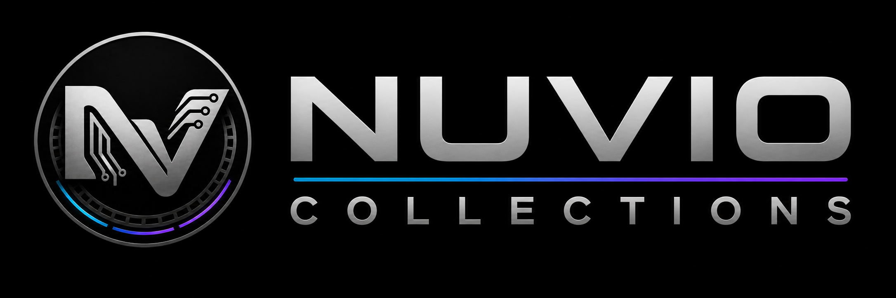
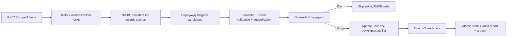

<p align="center">
  
</p>

<p align="center">
  <a href="https://github.com/nosvasedis/Nuvio-Collections/actions/workflows/sync.yml"></a>
  
  
  
  
  
  
  
</p>

<p align="center">
  <strong>Ελληνικές, δυναμικές και σημασιολογικά ελεγμένες συλλογές για το Nuvio.</strong><br>
  TMDB-backed rails που ανανεώνονται αυτόματα, χωρίς filler, mixed media lists ή κενά folders.
</p>

## Τι είναι

Το **Nuvio Collections v5.0** είναι το production σύστημα που μετατρέπει 519
folders και 2.492 ενεργά rails σε ένα έτοιμο προς εισαγωγή JSON για το Nuvio
0.8.3+. Δεν είναι ένα στατικό export: το repository περιέχει το canonical rail
registry, τους ακριβείς predicates, τα σταθερά public TMDB list IDs, τον
resumable synchronizer και το GitHub Actions workflow που κρατά τις λίστες
ενημερωμένες κάθε βράδυ.

Το τελικό artifact είναι το
[`dist/nuvio-collections-v5.0.json`](dist/nuvio-collections-v5.0.json).

## Κατάσταση release

| Έλεγχος | Αποτέλεσμα |
|---|---:|
| Collections | 12 |
| Folders | 519 — τα αρχικά 517 διατηρούνται και προστέθηκαν 2 |
| Ενεργά sources | 2.492 |
| Managed sources | 2.490 |
| Materialized TMDB lists | 2.092 |
| Native Nuvio/TMDB sources | 398 |
| Χειροκίνητα ορισμένα `recommended` sources | 2 |
| Κενά ενεργά rails | **0** |
| Κενά folders | **0** |
| Unresolved list IDs | **0** |
| Trakt / runtime-addon sources | **0 / 0** |
| Automated tests | **36 / 36** |

Τα 42 sources που επέστρεφαν αποδεδειγμένα μηδενικό αποτέλεσμα με τον ακριβή
predicate τους έχουν αποσυρθεί. Δεν διαγράφηκε ούτε συγχωνεύτηκε κανένα folder.
Επιπλέον, αποσύρθηκαν μετά από ρητή έγκριση τα 6 TV rails των Jason Statham και
Tom Cruise: τα επίσημα TMDB credits τους δεν περιέχουν κανέναν ουσιαστικό
τηλεοπτικό ρόλο, μόνο self/guest/archive/uncredited εμφανίσεις. Τα παλιά list IDs
φυλάσσονται στο `state.retiredRails` ως audit/rollback
tombstones, αλλά δεν εμφανίζονται στο Nuvio και δεν ενημερώνονται nightly.

Ο folder `Προτεινόμενα` είναι σκόπιμα χειροκίνητος και εξαιρείται από τον TMDB
materializer. Η canonical έκδοση v5.0 ανακατευθύνει τις ταινίες στο
`movielens.explore.toppicks.msly9zlu` και τις σειρές στο
`simkl.recipe.marathon.shows` μέσω του addon `aio-metadata`. Το folder
fingerprint κλειδώνεται ώστε bootstrap/compile/nightly sync να μην αλλάζουν
σιωπηρά αυτά τα links.

## Τελική χαρτογράφηση

| Collection | Native | Materialized | Σύνολο |
|---|---:|---:|---:|
| Discover, χωρίς `recommended` | 2 | 10 | 12 |
| Streaming | 0 | 455 | 455 |
| Genres | 0 | 180 | 180 |
| Film Series | 186 | 0 | 186 |
| Studios | 0 | 107 | 107 |
| Networks | 30 | 29 | 59 |
| Actors | 0 | 744 | 744 |
| Directors | 0 | 186 | 186 |
| Awards | 0 | 60 | 60 |
| World | 0 | 311 | 311 |
| Decades | 180 | 6 | 186 |
| Runtime | 0 | 4 | 4 |
| **Managed σύνολο** | **398** | **2.092** | **2.490** |

## Τι σημαίνει «ακριβές»

Η ακρίβεια είναι εκτελέσιμο contract, όχι χειροκίνητη υπόσχεση:

1. Το όνομα κάθε rail αντιστοιχεί σε καταγεγραμμένο predicate στο
   `config/rails.yml`.
2. Το predicate εκτελείται πάνω στα επίσημα TMDB δεδομένα και στις επίσημες
   TMDB/JustWatch watch-provider εγγραφές.
3. Κάθε released-only candidate αποκλείει future, adult και video entries.
4. Κάθε materialized list είναι αποκλειστικά `movie` ή αποκλειστικά `tv`.
5. Γίνεται ordered deduplication με `(media_type, TMDB ID)` και σταθερό
   tie-breaker.
6. Η σειρά αποθηκεύεται με `sortBy: original`, επειδή το Nuvio μπορεί να
   ταξινομήσει διαφορετικά μόνο την τρέχουσα σελίδα.
7. Δεν προστίθεται filler και candidate μηδενικού μεγέθους δεν δημοσιεύεται ως
   ενεργό rail.
8. Κάθε materialized candidate απαιτεί πραγματικό TMDB `poster_path`. Αν λείπει,
   γίνεται details verification και αποκλείεται μέχρι να αποκτήσει poster.
9. Μετά από write διαβάζεται ξανά ολόκληρη η TMDB list μέσω του ίδιου v3
   pagination path που χρησιμοποιεί το Nuvio και απαιτείται exact typed-order
   match.

Η εγγύηση αφορά την πιστή εφαρμογή των predicates στα επίσημα upstream
δεδομένα. Αν το TMDB ή το JustWatch έχει λανθασμένο ή καθυστερημένο metadata, το
project δεν μπορεί να εφεύρει την πραγματική πληροφορία· αποτρέπει όμως τη
δημοσίευση τεχνικά λανθασμένων, mixed, incomplete ή ανεπιβεβαίωτων lists.

Στο τελευταίο πλήρες scan αποκλείστηκαν 3.602 posterless rail-occurrences. Το
`Somebody Knows Something` (TMDB TV 330654) επαληθεύτηκε με
`poster_path: null` και δεν δημοσιεύεται. Θα επιστρέψει αυτόματα αν προστεθεί
poster στο TMDB. Ο κανόνας επιβάλλεται στα 2.092 materialized rails. Τα 398
native sources εκτελούνται απευθείας από το Nuvio 0.8.3, το οποίο δεν παρέχει
υποστηριζόμενο `has poster` filter· η εξαίρεση καταγράφεται ρητά αντί να
προσποιείται το repository ότι μπορεί να την επιβάλει.

## Semantics ανά collection

### Discover

- `Trending`: επίσημο `/trending/{movie|tv}/day`. Σε provider rail μόνο όταν το
  day window είναι κενό σε GR και Worldwide, χρησιμοποιείται το επίσημο `week`
  window· δεν υποκαθίσταται με ψευδές popularity rail.
- `Popular`: `popularity.desc`.
- `Top`: rating ordering με προσαρμοσμένο vote quorum.
- `New` και `Top of the year`: 1 Ιανουαρίου του τρέχοντος έτους έως σήμερα.
- `Recent`: rolling παράθυρο 24 μηνών έως σήμερα.
- Τα δύο fixed classic rails παραμένουν native. Ό,τι δεν αποδίδεται σωστά από
  το Nuvio γίνεται materialized.

### Streaming — Ελλάδα → Worldwide

Κάθε ένα από τα 455 streaming rails αξιολογείται ανεξάρτητα:

1. Εκτελείται ο πλήρης predicate για `GR`.
2. Επιτρέπονται μόνο `flatrate`, `free` και `ads`· `rent`/`buy`-only τίτλοι
   απορρίπτονται.
3. Αν το επιτυχημένο GR αποτέλεσμα έχει item, χρησιμοποιείται μόνο GR.
4. Μόνο όταν το επιτυχημένο GR αποτέλεσμα είναι ακριβώς μηδέν εκτελείται
   Worldwide union όλων των επίσημων TMDB regions για τον ίδιο provider.
5. GR και Worldwide αποτελέσματα δεν αναμειγνύονται ποτέ.

API error δεν θεωρείται «κενή Ελλάδα» και δεν ενεργοποιεί fallback. Provider
aliases επιτρέπονται μόνο ως regional ονομασίες της ίδιας υπηρεσίας· τρίτα
channel subscriptions δεν προστίθενται σε folder άλλης υπηρεσίας.

### Genres, Film Series, Studios και Networks

- Χρησιμοποιείται η σωστή movie/TV taxonomy. TV Thriller, Fantasy και War
  εφαρμόζουν ειδικά keywords/tags και όχι άσχετες προσεγγίσεις.
- Τα ντοκιμαντέρ φύσης απαιτούν Documentary και δέχονται τα ισοδύναμα sparse
  TMDB tags nature/wildlife/natural history/environment/ecology.
- Τα 186 Film Series παραμένουν επίσημα TMDB `COLLECTION` sources και δεν
  λαμβάνουν filters που το Nuvio αγνοεί.
- Όλα τα movie studio rails κάνουν details verification: runtime τουλάχιστον
  40′, released έως σήμερα, όχι Documentary/TV Movie, adult ή video. Άρα shorts,
  specials, making-of και τηλεταινίες δεν βαφτίζονται studio feature films.
- Walt Disney Animation Studios, Pixar, Illumination και Studio Ghibli έχουν
  reviewed baselines **64 / 31 / 17 / 25** ταινιών από τις curated Trakt lists
  **28495261 / 801240 / 23223808 / 801239**. Παραμένουν TMDB lists για το Nuvio,
  ταξινομούνται νεότερη→παλαιότερη και επεκτείνονται μόνο με νέα TMDB company
  results που περνούν όλο το feature/animation/poster contract.
- Το Ghibli επιτρέπει ειδικά feature-length TMDB TV Movie classification επειδή
  ανήκει στο reviewed canon του· τα άλλα τρία canons την αποκλείουν.
- Studio `Recent` εφαρμόζει πρώτα rolling 24 μήνες. Αν εκεί υπάρχουν μόνο noise
  ή κανένα feature, εμφανίζει τα πιο πρόσφατα έγκυρα feature films του studio,
  ποτέ filler και ποτέ κενό rail.
- Network Popular rails είναι native και τα Recent materialized όπου απαιτείται
  πλήρης ordering/ημερομηνιακή ακρίβεια.

### Actors και Directors

- Actors: μόνο cast credits, όχι producer/writer/crew-only συμμετοχές.
- Directors: μόνο crew credits με `job=Director`.
- Popularity, ημερομηνία και rating εφαρμόζονται πάνω στα επιλέξιμα works και
  όχι στη σειρά ενός γενικού credits endpoint.
- Credits rails μπορούν να διατηρούν όλο το επιλέξιμο ιστορικό και δεν κόβονται
  τεχνητά στα 200 items.
- Self/archive/uncredited/host και άλλες μη ουσιαστικές εμφανίσεις αποκλείονται
  καθολικά. Τα Top rails χρησιμοποιούν vote-aware score ώστε ένα 10/10 από μία
  ψήφο να μην εκτοπίζει καθιερωμένα έργα.

### Awards

Και τα 60 rails είναι winners-only. Acting/directing awards materialize το έργο
που κέρδισε, όχι το person profile.

- Oscars: versioned winners snapshot από το επίσημο Academy Awards Database,
  98 ceremonies έως award year 2025.
- Cannes: versioned επίσημο Festival de Cannes retrospective snapshot έως 2026.
- Golden Globes: επίσημο archive μαζί με mapped TMDB Awards histories.
- Ambiguous title/year/contributor resolution αποτυγχάνει κλειστά και απαιτεί
  reviewed override που εξακολουθεί να επαληθεύει το TMDB endpoint.

Verified award candidates επαναχρησιμοποιούνται nightly και γίνεται πλήρες
refresh τουλάχιστον κάθε επτά ημέρες ή με `--force`.

### World, Decades και Runtime

- World: inclusion με `with_origin_country`, χωρίς να αποκλείονται πραγματικές
  πολύγλωσσες ή διεθνείς συμπαραγωγές λόγω original language.
- Decades: ακριβή date bounds. Η τρέχουσα χρονιά και τα 2020s σταματούν σήμερα,
  χωρίς future releases.
- Runtime: movie-only, ακριβή και μη επικαλυπτόμενα όρια.

| Runtime rail | Όριο |
|---|---:|
| Short | `< 90` λεπτά |
| Standard | `90–149` λεπτά |
| Long | `150–179` λεπτά |
| Epic | `≥ 180` λεπτά |

## Nuvio 0.8.3 compatibility contract

- Native filters επιτρέπονται μόνο σε source types που τα καταναλώνουν.
- `LIST`, `COLLECTION`, `PERSON` και `DIRECTOR` δεν λαμβάνουν ψεύτικα filters.
- Υποστηρίζονται τα `withoutGenres`, `withoutKeywords`, `withoutCompanies` και
  `withoutWatchProviders` και μεταφέρονται στα ακριβή TMDB Discover parameters.
- Unsupported ή source-inapplicable filter προκαλεί αποτυχία του audit.
- Δεν εκπέμπονται ανύπαρκτα runtime, cast, crew, trending-window ή selected
  monetization fields.

## Nightly ενημέρωση

Το workflow εκκινεί καθημερινά στις **04:07 ώρα Ελλάδας**. Δύο UTC cron entries
και εσωτερικό `Europe/Athens` guard εξασφαλίζουν μία εκτέλεση ανεξάρτητα από
θερινή ή χειμερινή ώρα.



### Γιατί είναι γρήγορο

- Bounded concurrency και coalescing ίδιων TMDB requests.
- Reuse person credits/provider availability μεταξύ sibling rails.
- Verified snapshots για immutable historical awards.
- Ordered fingerprints: μηδενικά writes για αμετάβλητες lists.
- Ownership recovery και των 2.092 stable list IDs πριν από create/update.
- Resumable sync ανά rail με durable checkpoints.

Τελευταία live μέτρηση μετά το production release στις 10 Αυγούστου 2026:

| Εργασία | Χρόνος | Αποτέλεσμα |
|---|---:|---|
| Production v5.0 reconciliation | 376,9 s | 84 verified updates, 15 creates, 0 failures |
| Post-production full dry-run, 2.092 rails | 38,3 s | 0 changes, 0 failures, 2.092 skips |
| Poster validation | ίδιο run | 3.426 exclusions, κανένα κενό candidate |
| Tests + compile + strict audit | < 3 s τοπικά | 36/36, 2.492 sources, 0 unresolved IDs |

Ο nightly χρόνος εξαρτάται από changed fingerprints και TMDB rate limits. Το
εβδομαδιαίο πλήρες awards refresh είναι σκόπιμα βαρύτερο.

## Fail-safe συμπεριφορά

- `429`: `Retry-After` και exponential backoff.
- API failure: ποτέ empty result ή Worldwide fallback.
- Worldwide failure: διατήρηση previous last-known-good list.
- Μεγάλη μεταβολή: δεύτερο ανεξάρτητο fetch.
- Candidate failure: κανένα clear ή partial production write.
- Duplicate rail key: fail closed πριν από create.
- Ambiguous create response: κανένα blind retry/duplicate.
- Typed TMDB `Media is invalid`: quarantine μόνο του item, retry σε 30 ημέρες.
- Δύο ίδια syncs: μηδενικά TMDB writes.
- Nightly sync: καμία διαγραφή folder, source ή list.

## Δομή repository

| Path | Ρόλος |
|---|---|
| `config/rails.yml` | Canonical rail registry και predicates |
| `config/providers.yml` | Providers, aliases και GR/Worldwide policy |
| `config/awards.yml` | Award mappings και reviewed overrides |
| `config/folders.lock.json` | Προστασία και των 519 folders |
| `state/sync-state.json` | List IDs, fingerprints, checkpoints και tombstones |
| `data/` | Versioned award snapshots και curated studio feature baselines |
| `src/` | Compiler, materializers, validators και synchronizer |
| `tests/` | Unit και semantic contract tests |
| `docs/SEMANTIC-CONTRACT.md` | Durable κανόνες, regressions και hand-off evidence |
| `AGENTS.md` | Υποχρεωτική διαδικασία για επόμενους agents/contributors |
| `reports/latest.json` | Αναλυτικό αποτέλεσμα τελευταίου sync |
| `dist/nuvio-collections-v5.0.json` | Τελικό Nuvio import artifact |
| `dist/nuvio-collections-v5.0-profile-repair.json` | Replacement artifact μόνο για collections με profile drift |
| `reports/profile-audit-2026-08-10.json` | Evidence του reviewed Nuvio export και των media-type mismatches |
| `assets/branding/` | Product mark και horizontal wordmark |

## Commands

Απαιτείται Node.js 22+· το hosted workflow χρησιμοποιεί Node.js 24.

```powershell
npm test                    # 36 automated contract tests
npm run audit               # structure, counts, locks και compatibility
npm run sync:dry            # live candidates, χωρίς remote writes
npm run sync                # production reconciliation
npm run compile             # τελικό Nuvio v5.0 JSON
npm run validate:awards     # live validation όλων των award rails
npm run capability-probe    # προσωρινό TMDB list capability test
npm run profile:audit -- --profile=<export.json> --write-repair
```

Production writes απαιτούν `--execute` και
`CONFIRM_TMDB_LIST_WRITES=NUVIO-TMDB-LISTS`. Τα secrets υπάρχουν μόνο στο
τοπικό `.env` ή στα GitHub Actions secrets:

- `TMDB_API_READ_TOKEN`
- `TMDB_USER_ACCESS_TOKEN`
- `TMDB_ACCOUNT_OBJECT_ID`

Το `.env` είναι ignored και δεν πρέπει να γίνεται commit.

## Import στο Nuvio

1. Κατέβασε το
   [`nuvio-collections-v5.0.json`](dist/nuvio-collections-v5.0.json).
2. Χρησιμοποίησε Nuvio 0.8.3 ή νεότερο.
3. Πριν από το import, άνοιξε τις ξεχωριστές ρυθμίσεις **Nuvio → TMDB**:
   ενεργοποίησε το TMDB, όρισε **Γλώσσα: Ελληνικά (`el`)** και άφησε το
   **Artwork** ενεργό. Το Nuvio έχει default TMDB language `en` και το
   collections JSON δεν διαθέτει supported field που να το παρακάμπτει.
4. Κάνε import από το Collections configuration του Nuvio.
5. Άφησε `sortBy: original` στα materialized `LIST` sources.
6. Κάνε smoke test σε pagination, Streaming GR/Worldwide, Awards, Runtime και
   ένα rail από καθεμία από τις 12 collections.

### Repair παλιού `Σειρά → Ταινία` profile

Το reviewed Nuvio export της 10ης Αυγούστου 2026 αποθήκευσε 980 managed TV rails ως
`type: series` αλλά `mediaType: MOVIE`. Το Nuvio εμφανίζει τον τύπο από το
`mediaType`, άρα το ορατό suffix έγινε «Ταινία». Το 981ο `series` source ήταν το
προστατευμένο Recommended addon, όπου το nullable `mediaType` είναι έγκυρο και
παραμένει ανέγγιχτο. Το τελικό artifact επιβάλλει
παντού `series/TV` και `movie/MOVIE`.

1. Κάνε import το πλήρες v5.0 ή το
   [`profile-repair`](dist/nuvio-collections-v5.0-profile-repair.json). Το Nuvio
   αντικαθιστά τις επηρεασμένες collections βάσει σταθερού collection ID.
2. Περίμενε να ολοκληρωθεί το profile sync και κάνε νέο export.
3. Τρέξε `npm run profile:audit -- --profile=<νέο-export.json>`.
4. Αποδέξου το migration μόνο με `mediaTypeMismatches: 0` και `missing: 0`.

Δεν απαιτείται καθημερινό re-import: τα public TMDB list IDs είναι σταθερά και
το nightly workflow ενημερώνει το περιεχόμενό τους στη θέση του.

## Branding

Η product identity συνδυάζει το NVASEDIS circuit monogram με κινηματογραφικά
frames και stacked collection cards.

- [`assets/branding/nuvio-collections-mark.png`](assets/branding/nuvio-collections-mark.png)
- [`assets/branding/nuvio-collections-wordmark.png`](assets/branding/nuvio-collections-wordmark.png)

## Data attribution

Το project χρησιμοποιεί δεδομένα TMDB. Τα watch-provider δεδομένα παρέχονται
από το JustWatch μέσω TMDB. Η απαιτούμενη TMDB/JustWatch attribution πρέπει να
είναι εμφανής και στο consuming product· η αναφορά μόνο στο repository δεν
καταργεί αυτή την υποχρέωση.

---

<p align="center">
  <strong>Nuvio Collections v5.0</strong><br>
  Deterministic rails. Stable list IDs. Verified nightly updates.
</p>
